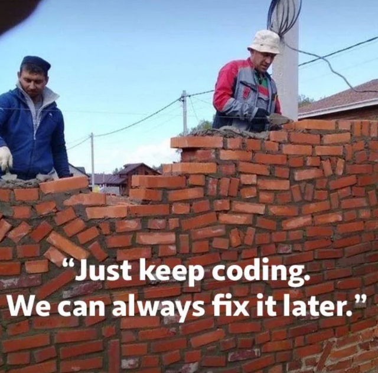

<h3>delusional autistic game engineer</h3>

<strong>rules i follow</strong>
<blockquote>
	❌stable 
	❌memory safe 
	❌predictable 
	❌portable 
	❌safe 
	❌tested 
	❌planning 
	❌error handling 
	 
	✅memory leaks 
	✅undefined behavior 
	✅works on my machine 
	✅segmentation faults 
	✅printf, the only debugger 
	✅improvisation 
	✅runtime errors 
	✅ignoring compiler warnings 
	✅fatal error: too many errors emitted, stopping now 
	 
	<small>some of it is sarcasm, some of it is true!</small>
</blockquote>

 

<strong>tech i use</strong>
<blockquote>
	<small>
	" > " = where i am in that category, 
	" >> " = something im currently focusing on, 
	anything above it means i already went through it, 
	anything below it means i am planning to look into it  </small>
	

<strong>engine/framework/graphics-library</strong>
<blockquote>
		&nbsp;&nbsp;Unity, raw HTML/JS, Unreal, Godot, Monogame, Raylib, Bevy, SDL, OpenGL (OpenGL-ES, WebGL), Roblox Studio 
		> SDL2, WebGPU 
		&nbsp;&nbsp;might try at some point: Vulkan, DirectX, SFML, Love2D, the Forge, bgfx 
	</blockquote>

	

<strong>tooling</strong>
<blockquote>
		&nbsp;&nbsp;Git - Github 
		&nbsp;&nbsp;Cmake 
		&nbsp;&nbsp;Emscripten - WASM 
		&nbsp;&nbsp;Lua 
		&nbsp;&nbsp;DPP discord bot (not really a tool) 
		>>custom codegen (in python) 
		&nbsp;&nbsp;Tracy profiler 
	</blockquote>

	

<strong>networking</strong>
<blockquote>
		&nbsp;&nbsp;basic client/server project 
		&nbsp;&nbsp;tried raw UDP 
		&nbsp;&nbsp;decided to stay with TCP 
		&nbsp;&nbsp;sent spatially partitioned entity component data 
		&nbsp;&nbsp;better dirty ecs component tracking to send only changes 
		> WebTransport - QUIC, imquic 
		&nbsp;&nbsp;grid based server-side fog of war 
		&nbsp;&nbsp;VPS? 
		&nbsp;&nbsp;UDP again? 
	</blockquote>

	

<strong>ecs</strong>
<blockquote>
		&nbsp;&nbsp;entt 
		&nbsp;&nbsp;serializable ECS components for networking/saving 
		&nbsp;&nbsp;spatially partitioned collision detection with swept box cast 
		&nbsp;&nbsp;linear and angular velocity 
		> flecs (with codegen) 
		&nbsp;&nbsp;more types of colliders, tilemap collider, SDF colliders? 
	</blockquote>

	

<strong>rendering</strong>
<blockquote>
		&nbsp;&nbsp;OpenGL/GLEW within SDL 
		&nbsp;&nbsp;tried compute shaders, but will use webGL 
		&nbsp;&nbsp;not using buffers as i should, but rather textures for everything (not ideal) 
		&nbsp;&nbsp;single shader for everything (also not ideal) 
		&nbsp;&nbsp;no separate thread (TPS = FPS) 
		&nbsp;&nbsp;custom text rendering 
		&nbsp;&nbsp;update/render thread separation + sub-tick interpolation 
		&nbsp;&nbsp;using vertices and indices more, for visibility order 
		&nbsp;&nbsp;frame buffer understanding, making graphics editor 
		&nbsp;&nbsp;tiny C-like language into wasm 
		&nbsp;&nbsp;VFX editor 
		> WebGPU 
	</blockquote>

	

<strong>audio</strong>
<blockquote>
		&nbsp;&nbsp;audio callback 
		&nbsp;&nbsp;spectrogram 
		&nbsp;&nbsp;spectral synthesis 
		> digital signal processing 
		&nbsp;&nbsp;DSP editor 
	</blockquote>

	

<strong>language</strong>
<blockquote>
		&nbsp;&nbsp;C#, JS, Rust, SQL, PHP 
		> C++, GLSL, WGSL, custom DSL for use with ECS 
	</blockquote>

	

<strong>LLM</strong>
<blockquote>
		&nbsp;&nbsp;gpt (browser), gemini (browser), gemini cli (decent amount of time until nerfed), cursor (barely tried), claude (barely tried) 
		> codex cli plus (reaching limit every week) 
	</blockquote>

	<small> progress updated April 30, 2026  discord: <strong>pyroxdd</strong></small>
</blockquote>

 
